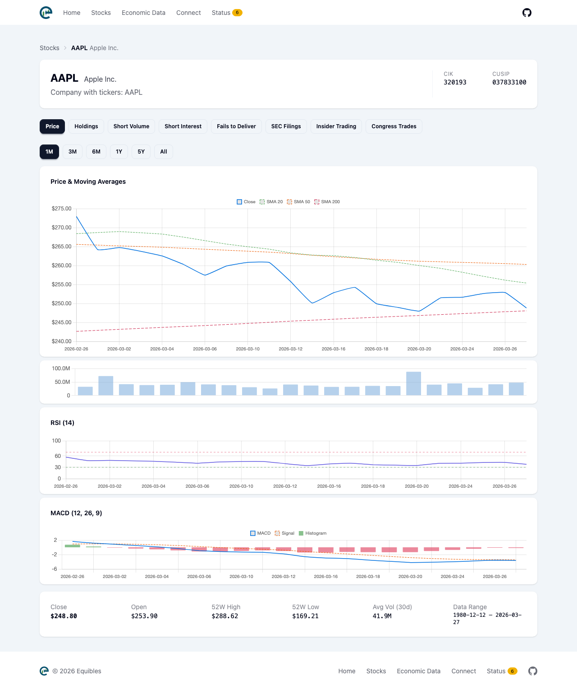
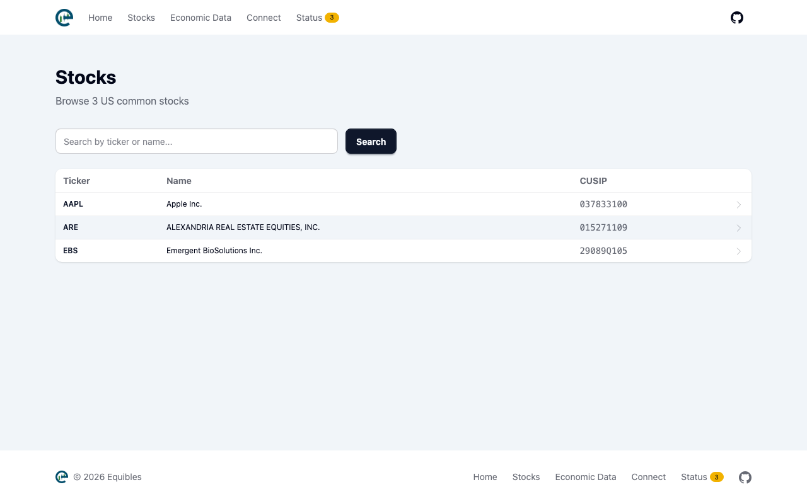
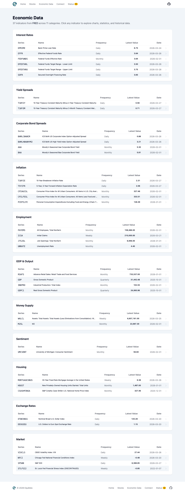
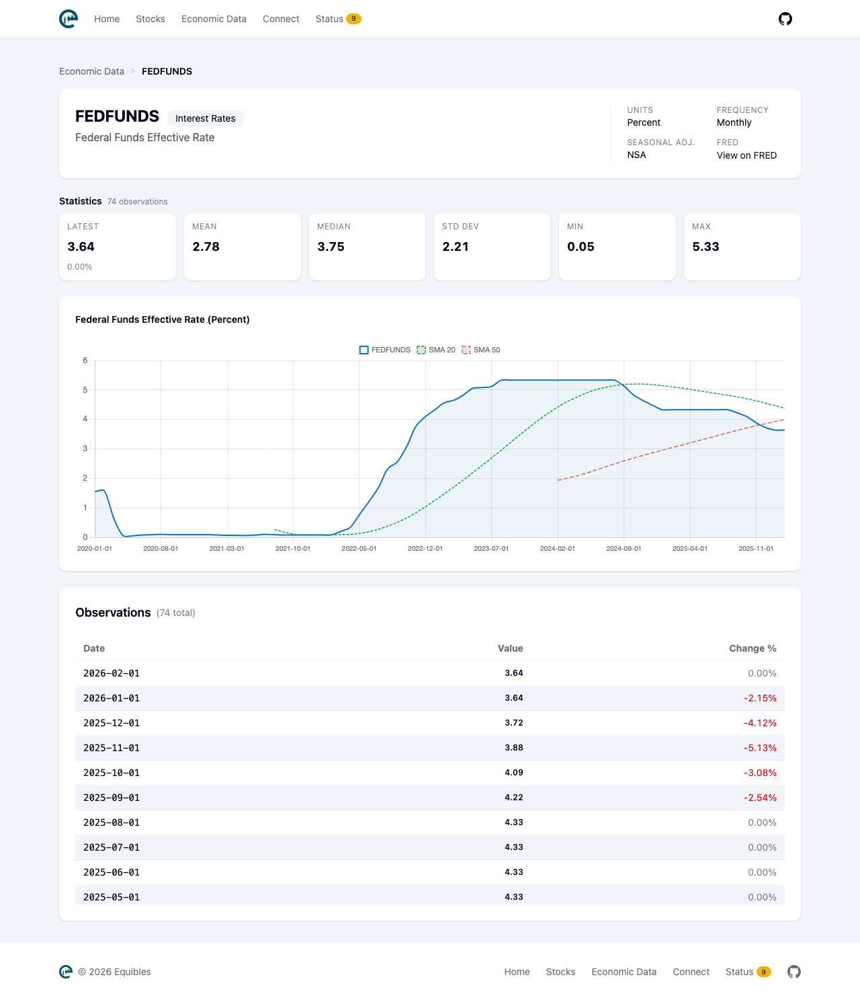

# Equibles

[](https://github.com/daniel3303/Equibles/actions/workflows/ci.yml)
[](https://codecov.io/github/daniel3303/Equibles)
[](LICENSE)
[](docker-compose.yml)
[](https://modelcontextprotocol.io)

An open-source, self-hosted mini Bloomberg Terminal for AI agents. Scrapes, stores, and serves SEC filings, institutional holdings, insider trading, congressional trades, short data, economic indicators, and daily stock prices — and exposes it all via MCP so your AI assistant can query it directly.

Powers [equibles.com](https://equibles.com).

## What's Included

| Domain | Data Source | Description |
|--------|------------|-------------|
| **SEC Filings** | SEC EDGAR | 10-K, 10-Q, 8-K annual/quarterly/current reports with full-text search |
| **Holdings** | SEC 13F-HR | Institutional ownership — who owns what, how much, and trend over time |
| **Insider Trading** | SEC Form 3/4 | Director, officer, and 10% owner transactions |
| **Congressional Trading** | House/Senate disclosures | Stock trades by members of Congress |
| **Short Data** | SEC / FINRA | Fails-to-deliver (SEC), daily short volume and short interest (FINRA) |
| **Economic Indicators** | FRED (Federal Reserve) | Interest rates, inflation, employment, GDP, yield spreads, and more |
| **Stock Prices** | Yahoo Finance | Daily OHLCV prices with technical indicators (SMA, RSI, MACD) |

## Quick Start

### Docker Compose (recommended)

The fastest way to get everything running. Requires Docker.

```bash
git clone https://github.com/daniel3303/Equibles.git
cd Equibles
cp .env.example .env
# Edit .env and set SEC_CONTACT_EMAIL (required by SEC EDGAR fair access policy)
docker compose up
```

This starts:

| Service | Port | Description |
|---------|------|-------------|
| **db** | 5432 | ParadeDB (PostgreSQL + pgvector + pg_search) |
| **web** | 8080 | Web portal for browsing data |
| **mcp** | 8081 | MCP server for AI assistants |
| **worker** | — | Scrapers (SEC, FINRA, Congress, FRED, Yahoo) |

Data scraping starts automatically. SEC filings, holdings, insider trades, and congressional trades will begin populating within minutes.

## Configuration

All settings can be configured via a `.env` file in the project root (recommended for Docker) or environment variables.

**FINRA Short Data (free API key required):**

The FINRA scraper (short volume and short interest) requires a free API key. Without it, the scraper skips gracefully and all other scrapers run normally. Fails-to-deliver data comes from SEC and works without FINRA credentials.

To get a key:
1. Create a free account at [developer.finra.org](https://developer.finra.org/)
2. Go to **Teams & Apps** and create a new application
3. Copy the **Client ID** and **Client Secret**
4. Set `Finra__ClientId` and `Finra__ClientSecret` in your `.env` file or environment variables

**FRED Economic Data (free API key required):**

The FRED scraper requires a free API key from the Federal Reserve Bank of St. Louis. Without it, the scraper skips gracefully and all other scrapers run normally.

To get a key:
1. Register at [fred.stlouisfed.org/docs/api/api_key.html](https://fred.stlouisfed.org/docs/api/api_key.html)
2. Copy the 32-character API key
3. Set `Fred__ApiKey` in your `.env` file or environment variables

**Ticker Filtering (optional):**

By default, all tickers are synced. To limit data syncing to specific stocks, set a single ticker list that applies to all scrapers:

```env
# .env — sync only these tickers (applies to all scrapers)
Worker__TickersToSync__0=AAPL
Worker__TickersToSync__1=MSFT
Worker__TickersToSync__2=GOOGL
```

When not set, all stocks are synced.

**Minimum Sync Date (optional):**

By default, all scrapers start from January 2020. Set a more recent date for faster initial sync, or go as far back as 2000-01-01 for more historical data:

```env
# .env — start syncing from 2024 instead of 2020
Worker__MinSyncDate=2024-01-01
```

**Embedding (opt-in):**

| Setting | Default | Description |
|---------|---------|-------------|
| `Embedding__Enabled` | `false` | Set to `true` to enable vector embedding generation |
| `Embedding__BaseUrl` | — | Ollama or OpenAI-compatible endpoint (e.g., `http://localhost:11434`) |
| `Embedding__ModelName` | — | Model name (e.g., `bge-m3`) |
| `Embedding__BatchSize` | `10` | Texts per embedding batch |

**Authentication (optional):**

| Setting | Default | Description |
|---------|---------|-------------|
| `AUTH_USERNAME` | — | Web portal username (auth disabled if empty) |
| `AUTH_PASSWORD` | — | Web portal password (auth disabled if empty) |
| `MCP_API_KEY` | — | MCP server API key (auth disabled if empty) |

When set, the web portal requires login and the MCP server requires `Authorization: Bearer <key>` header. When unset, everything is open access (default).

## Web Portal

The web portal at `http://localhost:8080` provides a browser-based interface for exploring data:

- **Stocks** — Browse and search all tracked companies, view price charts with technical indicators (SMA, RSI, MACD), institutional holdings, short data, SEC filings, insider trading, and congressional trades per stock
- **Economy** — Browse FRED economic indicators grouped by category (interest rates, inflation, employment, GDP, etc.) with charts and statistics
- **Status** — System health, worker status, data counts, and error log

## MCP Server

The MCP server exposes financial data tools for AI assistants (Claude, ChatGPT, etc.):

- **Institutional Holdings** — Top holders, ownership history, institution portfolios, institution search
- **Insider Trading** — Insider transactions, ownership summary, insider search
- **SEC Documents** — Full-text search, semantic search, document browsing, keyword search within filings
- **Economic Indicators** — FRED data lookup, latest macro snapshot, indicator search across categories

### Connecting to Claude Desktop

Add this to your Claude Desktop config file (`claude_desktop_config.json`):

**macOS**: `~/Library/Application Support/Claude/claude_desktop_config.json`
**Windows**: `%APPDATA%\Claude\claude_desktop_config.json`

```json
{
  "mcpServers": {
    "equibles": {
      "url": "http://localhost:8081/mcp"
    }
  }
}
```

Restart Claude Desktop and the Equibles tools will be available. You can then ask questions like "Who are the top institutional holders of AAPL?" or "Search Apple's latest 10-K for revenue growth discussion."

### Connecting to Claude Code

Add the MCP server to Claude Code:

```bash
claude mcp add equibles --transport http http://localhost:8081/mcp
```

### Connecting to ChatGPT Desktop

Add this to your ChatGPT Desktop config file:

**macOS**: `~/Library/Application Support/com.openai.chat/mcp.json`
**Windows**: `%APPDATA%\com.openai.chat\mcp.json`

```json
{
  "servers": {
    "equibles": {
      "url": "http://localhost:8081/mcp"
    }
  }
}
```

Restart ChatGPT Desktop and the Equibles tools will be available.

### Connecting to OpenClaw

In OpenClaw, add an MCP server with the URL `http://localhost:8081/mcp` (HTTP transport).

### Other MCP Clients

Any MCP-compatible client can connect to `http://localhost:8081/mcp` (HTTP transport).

## Vector Embeddings (advanced, opt-in)

Vector embeddings enable semantic search over SEC filings (e.g., "find revenue growth discussion in Apple's 10-K"). This requires downloading the Ollama runtime (~2GB) and the BGE-M3 model (~1.2GB).

```bash
docker compose --profile embedding up
```

This adds:

| Service | Port | Description |
|---------|------|-------------|
| **embedding** | 11434 | Ollama server with BGE-M3 model |
| **worker-embedding** | — | Worker with embedding generation enabled |

Without the embedding profile, BM25 full-text search via ParadeDB still works out of the box — vector search is purely additive.

## Screenshots

### Stock Detail



### Stocks



### Economic Data



### Economic Indicator Detail



## Contributing

See [CONTRIBUTING.md](CONTRIBUTING.md) for development setup, project architecture, and how to extend the platform.

## License

[AGPL-3.0](LICENSE)

## Author

Daniel Oliveira

[](https://danielapoliveira.com/)
[](https://x.com/daniel_not_nerd)
[](https://www.linkedin.com/in/daniel-ap-oliveira/)
